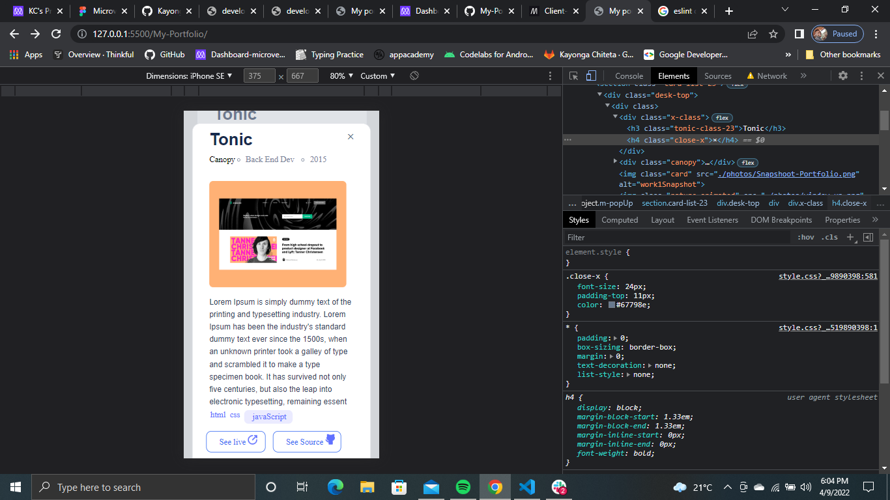

# My-Portfolio

> Portfolio  local storage.

## Built With

- html
- css
- javascript

To get a local copy up and running follow these simple example steps.

[Click here to view web](https://kayonga99.github.io/My-Portfolio/)

## Author

👤 **Kayonga Chiteta**

- GitHub: [@Kayonga99](https://github.com/Kayonga99)
- Twitter: [@KayongaChiteta3](https://twitter.com/KayongaChiteta3?t=gfILCjmltzGRZOx6FZ8-nQ&s=08)
- LinkedIn: [Kkayonga Chiteta](https://www.linkedin.com/in/kayonga-chiteta-776949227)

## 🤝 Contributing

Contributions, issues, and feature requests are welcome!

Feel free to check the [issues page](../../issues/).

## Show your support

Give a ⭐️ if you like this project!

## Acknowledgments

- Hat tip to anyone whose code was used
- Inspiration
- etc

## 📝 License

This project is [MIT](./MIT.md) licensed.
